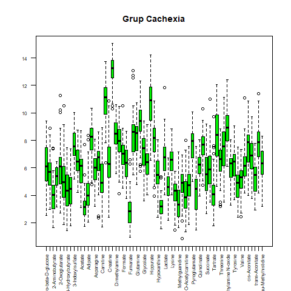
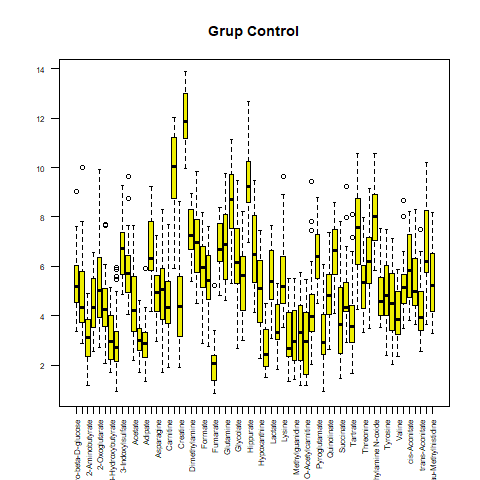

# Informe PAC 1

## Anàlisi de Dades Òmiques

### Veranika Aulastsova Aulastsova


Taula de continguts:

1.	Abstract

2.	Objectius

3.	Mètodes

4.	Resultats

5.	Discussió

6.	Conclusions

7.	Referències


**1. Abstract** Breu resum sobre el procés i els principals resultats. (150 paraules)


**2. Objectius** 

Els objectius de la següent anàlisi han sigut:

- Aprendre a utilitzar el package SummarizedExperiment per fer anàlisi de dades òmiques.

- Analitzar les dades del dataset amb l'intenció d'observar possibles relacions entre les variables amb els grups de pacients que presenten cachexia, i els pacients de grup control.


**3. Mètodes** 

Aquest treball s’ha basat en l’anàlisi del dataset “2024-Cachexia” del repositori github [1]. 
Cachexia és un síndrome definit per la pèrdua de la massa muscular esquelètica relacionada amb malalties com el càncer o el SIDA. Aquest síndrome augmenta les possibilitats del pacient de patir complicacions quirúrgiques o en el tractament. Actualment, els mecanismes moleculars que ho causen no són molt coneguts, i les opcions del tractament són limitades, fet pel qual considero que és un tema important d'estudi [2].


```{r}
library(readr)
cachexia <- read_csv("human_cachexia.csv") 
head(cachexia)
```

Tal i com s'observa, el fitxer amb les dades presenta una columna identificadora amb els IDs dels pacients, i una "muscle loss" que identifica si el pacient presenta cachexia o si és del grup control. La resta de les columnes presenta els valors d'estudi, els metabòlits.

Per fer l’anàlisi, s’ha descarregat el fitxer amb el dataset del repositori original, i s’ha fet servir l’R mitjançant Rstudio. El dataset “2024-Cachexia” contenia un fitxer amb curta descripció de les dades, "description.md", i un fitxer amb les dades, "human_cachexia.csv". El package principal ha sigut “SummarizedExperiment”. 

A continuació, s'ha creat un objecte SummarizedExperiment: "se_cachexia" (es pot trobat adjuntat en el repositori).


> *La classe SummarizedExperiment és una extensió d'ExpressionSet, utilitzada per moltes aplicacions i bases de dades (com és el cas de metabolomicsWorkbench). Quines són les seves principals diferències amb la classe ExpressionSet?*


ExpressionSet és una classe amb finalitats semblants al SummarizedExperiment, amb algunes diferències. En primer lloc, ExpressionSet és una classe que forma part del package Biobase del Bioconductor. Està dissenyada per combinar diverses fonts d'informació sobre un dataset en un objecte [3]. Una de les principals diferències entre els dos és la possibilitat de creació de més d'una matriu amb el SummarizedExperiment, i només una matriu amb el ExpressionSet [4].


Per crear l'objecte "se_cachexia" en primer lloc s'han extret les metadades del fitxer: la columna 1 amb els IDs dels pacients, i la columna 2 dels diferents grups.

```{r}
load("se_cachexia.Rda")
print(se_cachexia)
```

A continuació s'ha realitzat l'anàlisi de l'objecte.
El dataset conté 47 pacients que presenten cachexia, i 30 pacients control. En primer lloc, s'ha realitzat un anàlisi estadístic bàsic de les mitjanes, medianes, els quartils, etc., i una representació visual mitjançant Boxplots.
Després

**4.	Resultats** 

Les dades analitzades s'han separat segons el grup: control i cachexic. Els Boxplot del resum de les dades "raw" han resultat molt asimètrics, per això s'ha realitzat també transformació logarítmica i nous Boxplots.

```{r}

```


```{r}

```

S'observa com en el cas del grup Cachexia, els valors més alts corresponen a la Creatinina, seguits pel Citrat i Hippurate, fet que coincideix amb el grup Control. Els valors més baixos també concideixen en els dos grups, sent els valors del Fumarat.


**5.	Discussió** És important que reflexioneu sobre les limitacions de l' estudi i sobre el treball que heu realitzat, en el context del problema biològic d' interès que aborda la PEC. (1 pàgina)


**6.	Conclusions** Concises, clares i extretes de la vostra anàlisi. (1/2 pàgina)


**7. Referències** 

[1] El dataset analitzat és procedent del següent repositori: https://github.com/nutrimetabolomics/metaboData 
[2] https://www.mdpi.com/2073-4409/13/3/252
[3] https://www.bioconductor.org/packages/devel/bioc/vignettes/Biobase/inst/doc/ExpressionSetIntroduction.pdf 
[4] https://combine-australia.github.io/2017-05-19-bioconductor-melbourne/data_structures.html


Repositori del treball: https://github.com/aulsts/Aulastsova-Aulastsova-Veranika-PAC1.git 

