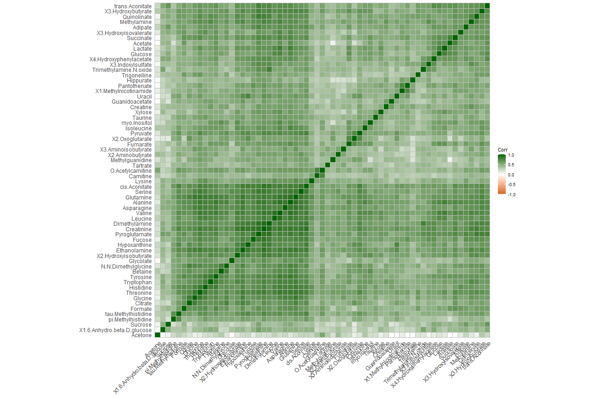

# Informe PAC 1


## Anàlisi de Dades Òmiques


### Veranika Aulastsova Aulastsova


#### **Taula de continguts:**

1.	Abstract

2.	Objectius

3.	Mètodes

4.	Resultats

5.	Discussió

6.	Conclusions

7.	Referències


#### **1. Abstract** 

En aquest treball s'ha analitzat un conjunt de dades que recull dades sobre diferents metabòlits en dos tipus de pacients, de grup control, i de pacients amb caquèxia, un estat de pèrdua de massa muscular, relacionat amb moltes malalties. Després d'anàlisis univariants i multivariants, s'ha conclòs que hi és present una alteració en els metabòlits en cas de caquèxia. S'han marcat alguns metabòlits més importants, però és necessari continuar amb l'estudi i aprofundir més en el tema analitzant més dades.


#### **2. Objectius** 

Els objectius de la següent anàlisi han sigut:

- Aprendre a utilitzar el package SummarizedExperiment per fer anàlisi de dades òmiques.

- Analitzar les dades del dataset amb la intenció d'observar possibles relacions entre els metabòlits amb els grups de pacients que presenten cachexia, i els pacients de grup control.


#### **3. Mètodes** 

Aquest treball s’ha basat en l’anàlisi del dataset “2024-Cachexia” del repositori github [1]. 
Cachexia és una síndrome definit per la pèrdua de la massa muscular esquelètica relacionada amb malalties com el càncer o el SIDA. Aquesta síndrome augmenta les possibilitats del pacient de patir complicacions quirúrgiques o en el tractament. Actualment, els mecanismes moleculars que ho causen no són molt coneguts, i les opcions del tractament són limitades, fet pel qual considero que és un tema important d'estudi [2].


```{r}
library(readr)
cachexia <- read_csv("human_cachexia.csv") 
head(cachexia)
```

Tal com s'observa, el fitxer amb les dades presenta una columna identificadora amb els IDs dels pacients, i una "muscle loss" que identifica si el pacient presenta cachexia o si és del grup control. La resta de les columnes presenta els valors d'estudi, els metabòlits.

Per fer l’anàlisi, s’ha descarregat el fitxer amb el dataset del repositori original, i s’ha fet servir l’R mitjançant Rstudio. El dataset “2024-Cachexia” contenia un fitxer amb curta descripció de les dades, "description.md", i un fitxer amb les dades, "human_cachexia.csv". El package principal ha sigut “SummarizedExperiment”. 

A continuació, s'ha creat un objecte SummarizedExperiment: "se_cachexia" (es pot trobar adjuntat en el repositori).


> *La classe SummarizedExperiment és una extensió d'ExpressionSet, utilitzada per moltes aplicacions i bases de dades (com és el cas de metabolomicsWorkbench). Quines són les seves principals diferències amb la classe ExpressionSet?*


ExpressionSet és una classe amb finalitats semblants al SummarizedExperiment, amb algunes diferències. En primer lloc, ExpressionSet és una classe que forma part del package Biobase del Bioconductor. Està dissenyada per combinar diverses fonts d'informació sobre un dataset en un objecte [3]. Una de les principals diferències entre els dos és la possibilitat de creació de més d'una matriu amb el SummarizedExperiment, i només una matriu amb el ExpressionSet [4].


Per crear l'objecte "se_cachexia" en primer lloc s'han extret les metadades del fitxer: la columna 1 amb els IDs dels pacients, i la columna 2 dels diferents grups.

```{r}
load("se_cachexia.Rda")
print(se_cachexia)
```

A continuació s'ha realitzat l'anàlisi de l'objecte.
El dataset conté 47 pacients que presenten cachexia, i 30 pacients control. En primer lloc, s'ha realitzat un anàlisi estadístic bàsic de les mitjanes, medianes, els quartils, etc., i una representació visual mitjançant Boxplots.
Per la resta d'anàlisi s'ha fet servir el package POMA [5]. S´han realitzat diferents anàlisis univariants i multivariants.


#### **4.	Resultats** 

Les dades analitzades s'han separat segons el grup: control i cachexic. Els Boxplot del resum de les dades "raw" han resultat molt asimètrics, per això s'ha realitzat també transformació logarítmica i nous Boxplots.


S'observa com en el cas del grup Cachexia, els valors més alts corresponen a la Creatinina, seguits pel Citrat i Hippurate, fet que coincideix amb el grup Control. Els valors més baixos també concideixen en els dos grups, sent els valors del Fumarat.


S'han realitzat **Boxplots** i gràfics de la **densitat** de les dades (amb el package POMA) abans de la normalització de les dades i després. 


S'ha observat mitjançant els **Boxplot** del package POMA i dades normalitzades, que tots els metabòlits presenten valors més alts en el grup amb cachexia, que en el control. 


En el gràfic de la **densitat**, observem que la majoria dels metabòlits presenta només un pic, presentant una distribució unimodal, i són bastant centrats.
Amb el gràfic d'**Outliers** s'observa com cap mostra es troba fora del seu grup concret, i hi ha forta superposició entre el grup control i cachexia, fet que significa poca variabilitat/poques diferències entre els dos.


**Els anàlisis univariants** de T-Student Test i el Mann Test s'han realitzat per trobar possibles diferències significatives entre els gups. Segons els valors del p-ajustat, la majoria (54) metabòlits presenten valors significatius (p<0'05), i per tant, són importants per l'estudi.


Gràcies a l'anàlisi dels components principals (**PCA**), en el gràfic dels loadings, s'observen els 10 metabòlits claus per diferenciar entre els grups cachexia i control: creatinine, valine, alanine, treonine, asparagine, glutamine, cis.aconitate, pyroglutamate, ethanolamine i dimethylamine.


Després del PCA, s'ha realitzat també **PLS-DA** (Partial Least-Squares Discriminant Analysis), segons el qual els metabòlits més importànts per la diferenciació entre els grups cachexia i control són: dimethylglicine, quinolinate, leucine, valine, glutamine, gluose, betaine, ...


Finalment, s'han fet càlculs de **correlació** i el seu gràfic. Les correlacions entre tots els metabòlits són positius, amb valors entre 0'9 i 0'5, suggerint existència de patrons comuns o pot ser paper comú en el síndrome.



(Tots els gràfics i tests mencionats es poden veure en el document del Codi.Rmd)


#### **5.	Discussió** 


La caquèxia és una síndrome que pot ser influenciat per molts factors, com genètics, ambientals i nutricionals, l'estudi de només metabòlits pot ser insuficient per entendre tot el procés. Per tant, pot ser que incloure més dades, o fer un estudi d'evolució dels metabòlits al llarg de temps donaria més informació. A més a més, com s'ha observat en els resultats, hi ha superposició entre els dos grups, i per tant i hi ha pacients de grup control que presenten perfils semblants als de pacients amb caquèxia, i viceversa. Això pot indicar el caràcter heterogènic de la malaltia i reforçar la idea de fer servir més dades.


A més a més, la caquèxia és normalment causada/relacionada per/amb altres malalties, com el càncer o SIDA. Considero important tenir més informació sobre els pacients, en primer lloc, el diagnòstic, i altres dades que poden ser importants, el sexe, l'edat, etc.


#### **6.	Conclusions** 

L'anàlisi metabolòmica a mostrat diferències significatives entre els grups de pacients amb caquèxia, i els grup controls sans. Els resultats obtinguts amb els tests univariants indiquen que la majoria dels metabòlits estudiats presenten diferències significatives entre els dos grups, fet que suggereix una alteració metabolòmica associada a la caquèxia.
Ara, l'anàlisi multivariants, en concret, PCA, ha identificat una superposició entre els grups, i ha destacat un conjunt de metabòlits, consistent d'alguns aminoàcids i altres components. El model PLS-DA també ha destacat alguns metabòlits, com en el cas del PCA, també són aminoàcids i altres compostos. Entre aquests metabòlits més clau hi és present la glucosa.

En conjunt, els resultats apunten a una alteració de les vies metabòliques en pacients amb caquèxia. No obstant això, és molt clar que en els resultats també està reflectit la complexitat de la caquèxia com un fet biològic mitjançant la superposició de grups. 

Els resultats d'aquest estudi ressalten la necessitat d'una anàlisi més profunda, possiblement amb més dades o amb dades d'altre tipus per comprendre millor la caquèxia i identificar els metabòlits més importants.


#### **7. Referències** 

Repositori del treball: https://github.com/aulsts/Aulastsova-Aulastsova-Veranika-PAC1.git 


[1] El dataset analitzat és procedent del següent repositori: https://github.com/nutrimetabolomics/metaboData 

[2] https://www.mdpi.com/2073-4409/13/3/252

[3] https://www.bioconductor.org/packages/devel/bioc/vignettes/Biobase/inst/doc/ExpressionSetIntroduction.pdf 

[4] https://combine-australia.github.io/2017-05-19-bioconductor-melbourne/data_structures.html

[5] https://www.bioconductor.org/packages/release/bioc/vignettes/POMA/inst/doc/POMA-workflow.html

POMA manual: https://bioconductor.org/packages/devel/bioc/manuals/POMA/man/POMA.pdf 

